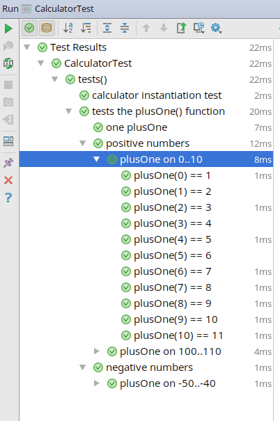

# DynaTest Dynamic Testing API prototype

[](https://travis-ci.org/mvysny/dynatest)

Kotlin-based piggybacking on JUnit5 dynamic test support. Experimental, unreleased, pretty much a playground.
Code example of the [CalculatorTest.kt](src/test/kotlin/CalculatorTest.kt):

```kotlin
class Calculator {
    fun plusOne(i: Int) = i + 1
    fun close() {}
}

/**
 * A test case.
 */
class CalculatorTest : DynaTest({

    /**
     * Top-level test.
     */
    test("calculator instantiation test") {
        Calculator()
    }

    // you can have as many groups as you like, and you can nest them
    group("tests the plusOne() function") {

        // demo of the very simple test
        test("one plusOne") {
            expect(2) { Calculator().plusOne(1) }
        }

        // nested group
        group("positive numbers") {
            // you can even create a reusable test battery, call it from anywhere and use any parameters you like.
            calculatorBattery(0..10)
            calculatorBattery(100..110)
        }

        group("negative numbers") {
            calculatorBattery(-50..-40)
        }
    }
})

/**
 * Demonstrates a reusable test battery which can be called repeatedly and parametrized.
 * @receiver all tests+groups do not run immediately, but instead they register themselves to this group; they are run later on
 * when launched by JUnit5
 * @param range parametrized battery demo
 */
fun DynaNodeGroup.calculatorBattery(range: IntRange) {
    require(!range.isEmpty())

    group("plusOne on $range") {
        lateinit var c: Calculator

        // analogous to @Before in JUnit4, or @BeforeEach in JUnit5
        beforeEach { c = Calculator() }
        // analogous to @After in JUnit4, or @AfterEach in JUnit5
        afterEach { c.close() }

        // we can even generate test cases in a loop
        for (i in range) {
            test("plusOne($i) == ${i + 1}") {
                expect(i + 1) { c.plusOne(i) }
            }
        }
    }
}
```

Running this in your IDE will produce:



Advantages:

* Support for test grouping
* Create and launch a reusable test battery easily

Drawbacks:

* Weak IDE (Intellij) integration:
  * `F4` navigation from the failed test to sources doesn't work
  * "Rerun failed tests" always runs all tests
  * Impossible to run just a single test (by right-clicking on the test)
  * [Spek](http://spekframework.org/) provides good IDE integration, but at the price
    of having a [Spek Plugin](https://plugins.jetbrains.com/plugin/8564-spek).
